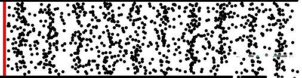
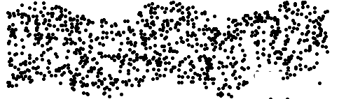
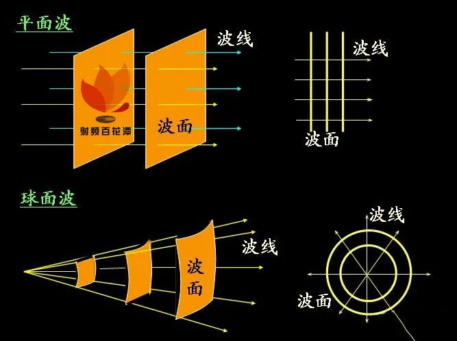
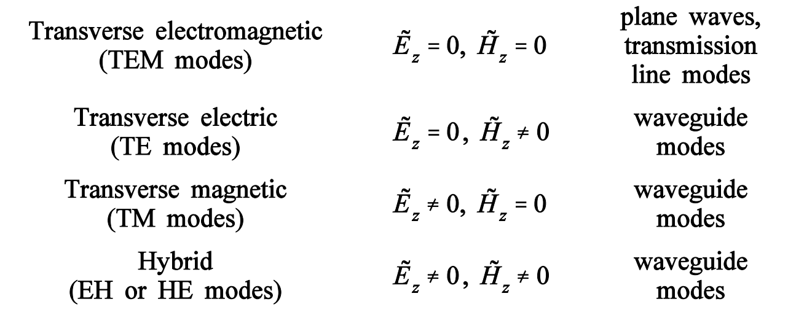
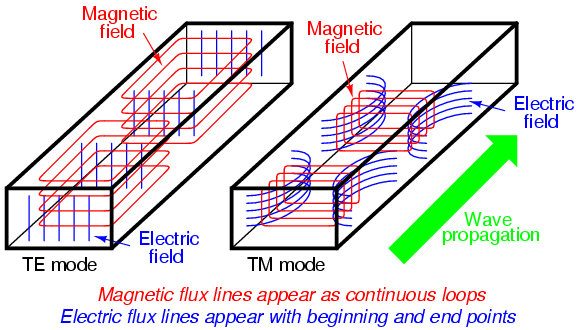
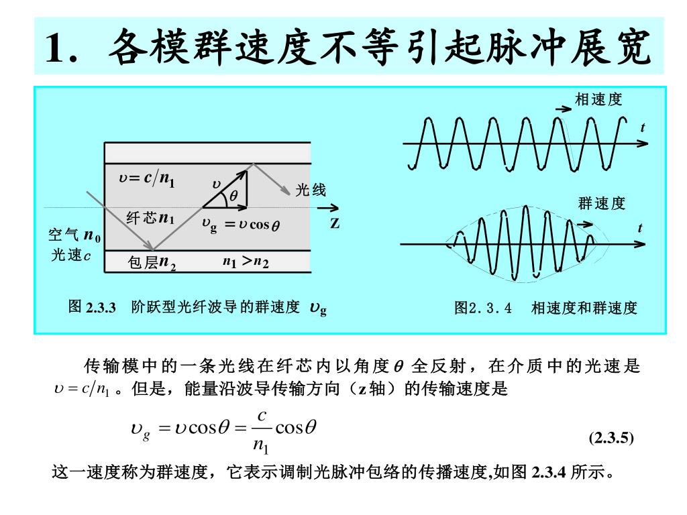
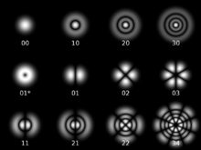
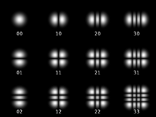

# TEM、TE、TM电磁波

我们先来看看什么是横波和纵波。**波的振动方向最基本的情况可分两种:** 

纵波：传播方向和振动方向平行

横波：传播方向和振动方向垂直

振动具有线性叠加性,故波动也同样满足线性叠加性,因此任何其他的方向关系的波动都可以由这两种波通过线性叠加而得到。

还不清楚可以看YouTube上的解释：

[Transverse & Longitudinal Waves | Waves | Physics | FuseSchool](https://www.youtube.com/watch?v=0Anh9HthWgQ)

https://en.wikipedia.org/wiki/Transverse_wave

https://en.wikipedia.org/wiki/Transverse_mode

https://en.wikipedia.org/wiki/Longitudinal_wave

https://en.wikipedia.org/wiki/Longitudinal_mode

总的来说，所有的波都是影响空间中的“粒子”，

**纵波**就是在传播方向振动的，使得粒子在传播方向上来回运动，来回运动的位置和速度可以用函数表达：

- y is the displacement of the point on the traveling sound wave（y处的粒子离原来位置的距离）

- *x* is the distance from the point to the wave's source;（和振动点的位置）

- *t* is the time elapsed;

- *y*0 is the amplitude of the oscillations,

- *c* is the speed of the wave; and

- *ω* is the angular frequency of the wave.

  这些粒子全部加起来就是波动。

**横波**就是振动方向和传播方向垂直的波。你可以想象一个粒子在竖直方向上来回震动，很多这样的的粒子在一起振动，便形成了横波。

横波也可以用上面的表达式来表达，只不过y变成了在竖直方向上离原点的距离。

关于更详尽的波动方程解释可以看下面的链接：

[16.2 Mathematics of Waves](https://courses.lumenlearning.com/suny-osuniversityphysics/chapter/16-2-mathematics-of-waves/)

波动传播的复杂程度首先取决于传播介质的分布情况。

如果传播介质是一维的,那么波的传播方向就只能在一条线上。

如果传播介质是多维的,那么波将从波源出发,向任意方向传播。而波动传播的方向称为波射线(简称波线)。

由于波在介质中的传播是一个时间过程,所以必须考虑波在空间中分布的一些时间性的特性。

首先是相位的概念。由于波动是一种周期现象,因此在某一个时刻振子处于一个周期的什么位置是非常重要的物理特征,这种位置就叫做相位。其次在波的空间分布中由相位相同的各点组成的一个几何面,称为波阵面(简称波面)。波阵面的概念在应用波动图象来分析波动现象时是非常关键的。

波面的形状和波源与介质的分布性质密切相关。最简单的两种情形是:在各向同性的介质中,从点波源发出的波的波阵面是一簇同心球面,称为**球面波**;从平面状波源发出的波的波阵面是一簇平行平面,称为**平面波**。

1. 在自由空间中传播的均匀平面电磁波（空间中没有自由电荷，没有传导电流），电场和磁场都没有和波的传播方向平行的分量，都和传播方向垂直。此时电矢量E,磁矢量H和传播方向K两两垂直。**这种情况下，电磁波是横波。**

2. 沿一定途径(比如说波导)传播的电磁波为**导行电磁波**。根据麦克斯韦方程,导行电磁波在传播方向上一般是有E和H分量的。也就是说，**只有在波导等情况中才会产生模式**。在麦克斯韦方程组带入边界条件的解当中，我们分别讨论的是$E_z 和 H_z$，如下列公式所表达的：

$$
H_{x} = \frac{-\gamma}{h^2} \frac{\partial H_{z}}{\partial x} + \frac{j\omega\epsilon}{h^2} \frac{\partial E_{z}}{\partial y}
$$

$$
H_{y} = \frac{-\gamma}{h^2} \frac{\partial H_{z}}{\partial x} - \frac{j\omega\epsilon}{h^2} \frac{\partial E_{z}}{\partial x}
$$

$$
E_{x} = \frac{-\gamma}{h^2} \frac{\partial E_{z}}{\partial x} - \frac{j\omega\mu}{h^2} \frac{\partial H_{z}}{\partial y}
$$

$$
E_{x} = \frac{-\gamma}{h^2} \frac{\partial E_{z}}{\partial y} + \frac{j\omega\mu}{h^2} \frac{\partial H_{z}}{\partial x}
$$

|                    | 模式        |
| ------------------ | :---------- |
| $E_z=0$    $H_z=0$ | TEM         |
| $E_z=0$    $H_z≠0$ | TE          |
| $E_z≠0$    $H_z=0$ | TM          |
| $E_z≠0$    $H_z≠0$ | Hybrid mode |

**为什么会产生TE,TM？**

**什么是模式，模式就是没有激励源条件下的Maxwell方程的解。**

> 光的传播形态分类:根据传播方向上有无电场分量或磁场分量,可分为如下三类,任何光都可以这三种波的合成形式表示出来。 
>
> 1、**TEM波**:在传播方向上没有电场和磁场分量,称为横电磁波。若激光在谐振腔中的传播方向为z方向,那么激光的电场和磁场将没有z方向的分量!实际的激光模式是准TEM模,即允许Ez、Hz分量的存在,但它们必须<<横向分量,因为较大的Ez意味着波矢方向偏离光轴较大,容易溢出腔外,所以损耗大,难于形成振荡。
>
> 2、**TE波(即s波)**:在传播方向上有磁场分量但无电场分量,称为横电波。在平面光波导(封闭腔结构)中,电磁场分量有Ey, Hx, Hz,传播方向为z方向。 
>
> 3、**TM波(即p波)**:在传播方向上有电场分量而无磁场分量,称为横磁波。在平面光波导(封闭腔结构)中,电磁场分量有Hy, Ex, Ez,传播方向为z方向。
>
> **三者可以这样记忆:横电磁波就是电和磁都是横着的,横电波只有电场是横的,横磁波就只有磁场是横的**

如下图所示：

光纤举例：

> 图片来自百度。（鼠标总是双点，没法自己画图）。请想象一下，光线上的一个点，**微观的**传播方向（**相速度方向**）是沿着红线的方向的，如果电场方向垂直于纸面向内或向外，磁场方向就是在纸面内，与红线垂直的。那么，电场的方向与纸面垂直，就和纸面内的任意一条线垂直，就和光纤的中心线（那条虚线相当于是整个光一起传播的方向，所以是**群速度方向**）垂直，而磁场方向则是不与这条线垂直，这就是TE模。同理，也可理解TM模吧。
>
> 那么TEM模的微观传播方向（**相速度方向**）就应该是和那条虚线（**群速度方向**）平行的。但是光纤在实际生活中总会弯曲的，所以**TEM模在光纤中不存在**，TEM是理想情况下的平面波（即不拐弯一直向前走的波）。
>
> 
>
> 作者：小武w
> 链接：https://www.zhihu.com/question/58819962/answer/187984489
> 来源：知乎
> 著作权归作者所有。商业转载请联系作者获得授权，非商业转载请注明出处。

关于光纤中的群速度和相速度有人可能会有疑惑，可以看下面这张图片：

对于**激光谐振腔：**

纵模表示的是模式
$$
y=cos(kx-wt)
$$
我们先忽略时间项$wt$，因为纵模模式和时间没有太大关系。

两个纵模模式叠加，他的包络波要最强的情况（类似于干涉相消），经过两个腔长L的光程
$$
y_1+y_2 = cos[(k_1+k_2)x](因为两个波的波矢反向，一个是入射波，一个是经过腔面反射的波)
$$

$$
其中k_1=k_2,因为是相同的波反射回来
$$

$$
y_1+y_2 = cos(2kx)
$$

$$
2kL = 2n\pi{\,}(此时包络波最强) , {\quad} k=\frac{2\pi}{\lambda}
$$

$$
L=\frac{n}{2}\lambda {\quad}(n=1,2,3,...)
$$

这就是腔长和波长之间的关系，这样就可以根据腔长挑选出不同波长的光，也就是不同频率的光。（波长和频率之间的关系$\lambda=c*T=\frac{c}{v}$）

上面讨论的都是纵模。

下面开始讨论横模

横模是在传播方向上，的电场分量和磁场分量有无，产生的TEM，TE和TM。一般是光束的形状。如下图所示。

>Transverse modes occur in radio waves and microwaves confined to a waveguide, and also in light waves in an optical fiber and in a laser's optical resonator.

圆柱波导的模式图：Cylindrical transverse mode patterns TEM(pl)

方形波导的模式图：Rectangular transverse mode patterns TEM(mn)

