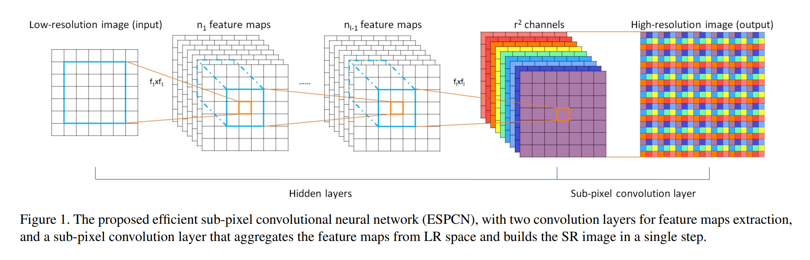

# PixelShuffle



PixelShuffle的过程如上图所示，图中彩色部分从$r^2$ channels -> High-resolution image的示意过程即为PixelShuffle；文字上描述为，将大小为（$r^2$, height, width）的图片卷积后的stack，变为大小为（1，height\*r, width\*r）的大小，为上采样的一种方法。

在pytorch中：

```python
torch.nn.PixleShuffle(upscale_factor)
```

但是，根据上图中的流程，PixelShuffle在使用之前需要先对其进行卷积。因为我们一开始拿到的图片是（height,width）大小的低分辨图片，要先经过卷积才能变成（$r^2$, height, width）大小的stack。

```
torch.nn.Conv2d(num_feature, num_feature*(upscale_factor**2) )
```

如上述代码所示，先将其通道数变为原来的upscale_factor的平方。