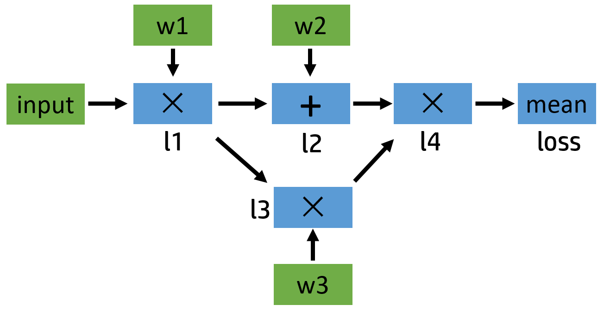
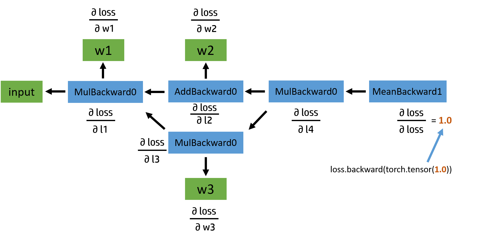

# PyTorch 的 Autograd机制

## 背景：

pytorch作为一个深度学习的平台，相比于numpy等python包强的地方大概有两点，一是自动求导的机制，二是支持GPU加速。自动求导的机制对于pytorch是一个非常重要的部分，现在深度学习很多部分都封装好了，我们只要像搭积木一样，简单拼凑在一起，也可以跑起来属于自己的深度学习模型。那我们还有必要了解自动求导机制吗？在我看来有两个原因需要我们了解：

1. 在我们需要自己定义loss function和optimizer的时候，了解pytorch后面的机制，就非常重要。而且因为现在深度学习领域更新速度非常快，我们会遇到非常多的场景需要自己定义loss function，所以理解自动求导机制是非常重要的。
2. 在深度学习过程中有很多有用的小trick，比如inplace的操作。有时候出现错误，需要我们了解背后的机制去debug。

本文的代码基于python 3和torch 1.1以上的。也就是不会涉及 0.4 版本以前的 Variable 这个数据结构。

## **计算图**

计算图就像是深度学习模型的整体图像。

在计算图里面有两个重要的元素，一个是tensor张量数据，一个是函数function。

> 假设我们有一个复杂的神经网络模型，我们把它想象成一个错综复杂的管道结构，不同的管道之间通过节点连接起来，我们有一个注水口，一个出水口。我们在入口注入数据的之后，数据就沿着设定好的管道路线缓缓流动到出水口，这时候我们就完成了一次正向传播。想象一下输入的 tensor 数据在管道中缓缓流动的场景，这就是为什么 TensorFlow 叫 Tensor**Flow** 的原因！emmm，好像走错片场了，不过计算图在 PyTorch 中也是类似的。至于这两个非常有代表性的深度学习框架在计算图上有什么区别，我们稍后再谈。

tensor大家都知道是什么东西，简单来说就是可以把数据表示为一个数据空间多个代数形式的量。function指的是计算图中某一个节点（node）上tensor做的运算，比如加减乘除，内积、外积、线性映射以及笛卡儿积等等。Function 内部有 `forward()` 和 `backward()` 两个方法，分别应用于正向、反向传播的标记。在数据做正向传播的过程中，除了执行 `forward()` 操作之外，还会同时会为反向传播做一些准备，为反向计算图添加 Function 节点。

举一个例子：

```python
import torch

a = torch.tensor(2.0, requires_grad=True)
b = a.exp()
print(b)
# tensor(7.3891, grad_fn=<ExpBackward>)
```

在上述的代码中，节点做的运算就是exp函数，在上边这个例子中，变量 `b` 在反向传播中所需要进行的操作是 `<ExpBackward>` 。求导时就会记住这个。

## **一个具体的例子**

> 下面的例子复制来自于[PyTorch 的 Autograd](https://zhuanlan.zhihu.com/p/69294347)

了解了基础知识之后，现在我们来看一个具体的计算例子，并画出它的正向和反向计算图。假如我们需要计算这么一个模型：

```text
l1 = input x w1
l2 = l1 + w2
l3 = l1 x w3
l4 = l2 x l3
loss = mean(l4)
```

这个例子比较简单，涉及的最复杂的操作是求平均，但是如果我们把其中的加法和乘法操作换成卷积，那么其实和神经网络类似。我们可以简单地画一下它的计算图：



下面给出了对应的代码，我们定义了`input`，`w1`，`w2`，`w3` 这三个变量(上图用绿色显示)，其中 `input` 不需要求导结果。根据 PyTorch 默认的求导规则，对于 `l1` 来说，因为有一个输入需要求导（也就是 `w1` 需要），所以它自己默认也需要求导，即 `requires_grad=True`。（这条规则不了解可见：[浅谈 PyTorch 中的 tensor 及使用](https://zhuanlan.zhihu.com/p/67184419)）

在整张计算图中，只有 `input` 一个变量是 `requires_grad=False` 的。正向传播过程的具体代码如下：

```python
input = torch.ones([2, 2], requires_grad=False)
w1 = torch.tensor(2.0, requires_grad=True)
w2 = torch.tensor(3.0, requires_grad=True)
w3 = torch.tensor(4.0, requires_grad=True)

l1 = input * w1
l2 = l1 + w2
l3 = l1 * w3
l4 = l2 * l3
loss = l4.mean()


print(w1.data, w1.grad, w1.grad_fn)
# tensor(2.) None None

print(l1.data, l1.grad, l1.grad_fn)
# tensor([[2., 2.],
#         [2., 2.]]) None <MulBackward0 object at 0x000001EBE79E6AC8>

print(loss.data, loss.grad, loss.grad_fn)
# tensor(40.) None <MeanBackward0 object at 0x000001EBE79D8208>
```

正向传播的结果基本符合我们的预期。我们可以看到，变量 `l1` 的 `grad_fn` **储存着乘法操作符** `<MulBackward0>`，用于在反向传播中指导导数的计算。而 `w1` 是**用户自己定义的**，不是通过计算得来的，所以其 `grad_fn` 为空；同时因为还没有进行反向传播，`grad` 的值也为空。接下来，我们看一下如果要继续进行反向传播，计算图应该是什么样子：



我们可以手动计算一下反向传播的结果，再和PyTorch的结果印证。

**手动计算:**

假设input为：

```python
input = [1.0, 1.0, 1.0, 1.0]
w1 = [2.0, 2.0, 2.0, 2.0]
w2 = [3.0, 3.0, 3.0, 3.0]
w3 = [4.0, 4.0, 4.0, 4.0]

l1 = input x w1 = [2.0, 2.0, 2.0, 2.0]
l2 = l1 + w2 = [5.0, 5.0, 5.0, 5.0]
l3 = l1 x w3 = [8.0, 8.0, 8.0, 8.0] 
l4 = l2 x l3 = [40.0, 40.0, 40.0, 40.0] 
loss = mean(l4) = 40.0
```

如反向传播的计算图所示，根据链式求导法则：

先求具体每个导数值：

首先$loss= \frac{1}{4}\sum_{i=0}^3l_4^i$所以$loss$对$l^i_4$的偏导分别为$\frac {\partial loss}{\partial l_4^i}=\frac{1}{4}$

接着 $\frac {\partial l_4}{\partial l_3}=l_2=[5.0,5.0,5.0,5.0]$, 同时$\frac {\partial l_4}{\partial l_2}=l_3=[8.0,8.0,8.0,8.0]$

现在看$l_3$对他的两个变量的偏导，

$\frac {\partial l_3}{\partial l_1}=w_3=[4.0,4.0,4.0,4.0]$​,

$\frac {\partial l_3}{\partial w_3}=l_1=[2.0,2.0,2.0,2.0]$

带入上述偏导，求$w_3$的导数为：
$$
\frac {\partial loss}{\partial w_3}=\frac {\partial loss}{\partial l_4}\frac {\partial l_4}{\partial l_3}\frac {\partial l_3}{\partial w_3} = [2.5,2.5,2.5,2.5]
， 和为10
$$
同理求$w_2$的导数为：
$$
\frac {\partial loss}{\partial w_2}=\frac {\partial loss}{\partial l_4}\frac {\partial l_4}{\partial l_2}\frac {\partial l_2}{\partial w_2} = [2.0,2.0,2.0,2.0]
， 和为8
$$
其他的导数计算基本上都类似，因为过程太多，这里就不全写出来了，如果有兴趣的话大家不妨自己继续算一下。

**Torch计算：**

```python
loss.backward()

print(w1.grad, w2.grad, w3.grad)
# tensor(28.) tensor(8.) tensor(10.)
print(l1.grad, l2.grad, l3.grad, l4.grad, loss.grad)
# None None None None None
```

首先我们需要注意一下的是，在之前写程序的时候我们给定的 `w` 们都是一个常数，利用了广播的机制实现和常数和矩阵的加法乘法，比如 `w2 + l1`，实际上我们的程序会自动把 `w2` 扩展成 [[3.0, 3.0], [3.0, 3.0]]，和 `l1` 的形状一样之后，再进行加法计算，计算的导数结果实际上为 [[2.0, 2.0], [2.0, 2.0]]，**为了对应常数输入，所以最后 `w2` 的梯度返回为矩阵之和 8** 。

另外还有一个问题，虽然 `w` 开头的那些和我们的计算结果相符，但是**为什么 `l1`，`l2`，`l3`，甚至其他的部分的求导结果都为空呢**？想要解答这个问题，我们得明白什么是叶子张量。

## **叶子张量**

当tensor是用户创建的时候，它是一个叶子张量/叶子节点；当它是运算产生的中间变量时，他就不是一个叶子张量/叶子节点。

对于任意一个张量来说，可以用`tensor.is_leaf`来判断它是否是叶子张量（leaf tensor）。在反向传播的过程中只有`is_leaf=True`的时候，需要求导的张量的倒数结果才会记录下来。

对于 `requires_grad=False` 的 tensor 来说，我们约定俗成地把它们归为叶子张量。但其实无论如何划分都没有影响，因为张量的 `is_leaf` 属性只有在需要求导的时候才有意义。

我们来看个例子：

```python
a = torch.ones([2, 2], requires_grad=True)
print(a.is_leaf)
# True

b = a + 2
print(b.is_leaf)
# False
# 因为 b 不是用户创建的，是通过计算生成的
```

这时有同学可能会问了，为什么要搞出这么个叶子张量的概念出来？原因是为了节省内存（或显存）。我们来想一下，那些非叶子结点，是通过用户所定义的叶子节点的一系列运算生成的，也就是这些非叶子节点都是中间变量，一般情况下，用户不会去使用这些中间变量的导数，所以为了节省内存，它们在用完之后就被释放了。

我们回头看一下之前的反向传播计算图，在图中的叶子节点我用绿色标出了。可以看出来，被叫做叶子，可能是因为游离在主干之外，没有子节点，因为它们都是被用户创建的，不是通过其他节点生成。对于叶子节点来说，它们的 `grad_fn` 属性都为空；而对于非叶子结点来说，因为它们是通过一些操作生成的，所以它们的 `grad_fn` 不为空。

我们有办法保留中间变量的导数吗？当然有，通过使用 `tensor.retain_grad()` 就可以：

```python
# 和前边一样
# ...
loss = l4.mean()

l1.retain_grad()
l4.retain_grad()
loss.retain_grad()

loss.backward()

print(loss.grad)
# tensor(1.)
print(l4.grad)
# tensor([[0.2500, 0.2500],
#         [0.2500, 0.2500]])
print(l1.grad)
# tensor([[7., 7.],
#         [7., 7.]])
```

如果我们只是想进行 debug，只需要输出中间变量的导数信息，而不需要保存它们，我们还可以使用 `tensor.register_hook`，例子如下：

```python
# 和前边一样
# ...
loss = l4.mean()

l1.register_hook(lambda grad: print('l1 grad: ', grad))
l4.register_hook(lambda grad: print('l4 grad: ', grad))
loss.register_hook(lambda grad: print('loss grad: ', grad))

loss.backward()

# loss grad:  tensor(1.)
# l4 grad:  tensor([[0.2500, 0.2500],
#         [0.2500, 0.2500]])
# l1 grad:  tensor([[7., 7.],
#         [7., 7.]])

print(loss.grad)
# None
# loss 的 grad 在 print 完之后就被清除掉了
```

这个函数的功能远远不止打印导数信息用以 debug，但是一般很少用。

> 到此为止，我们已经讨论完了这个实例中的正向传播和反向传播的有关内容了。回过头来看， input 其实很像神经网络输入的图像，w1, w2, w3 则类似卷积核的参数，而 l1, l2, l3, l4 可以表示4个卷积层输出，如果我们把节点上的加法乘法换成卷积操作的话。实际上这个简单的模型，很像我们平时的神经网络的简化版，通过这个例子，相信大家多少也能对神经网络的正向和反向传播过程有个大致的了解了吧。


## **inplace 操作**

现在我们来看一下本篇的重点，inplace operation。可以说，我们求导时候大部分的 bug，都出在使用了 inplace 操作上。现在我们以 PyTorch 不同的报错信息作为驱动，来讲一讲 inplace 操作吧。第一个报错信息：

```text
RuntimeError: one of the variables needed for gradient computation has been modified by an inplace operation: balabala...
```

不少人可能会感到很熟悉，没错，我就是其中之一。之前写代码的时候竟经常报这个错，原因是对 inplace 操作不了解。要搞清楚为什么会报错，我们先来了解一下什么是 inplace 操作：inplace 指的是在不更改变量的内存地址的情况下，直接修改变量的值。我们来看两种情况，大家觉得这两种情况哪个是 inplace 操作，哪个不是？或者两个都是 inplace？

```python
# 情景 1
a = a.exp()

# 情景 2
a[0] = 10
```

答案是：情景1不是 inplace，类似 Python 中的 `i=i+1`, 而情景2是 inplace 操作，类似 `i+=1`。`i+=1`和`i = i+1`的区别在于：对于可变的变量类型，`i+=1`不会改变变量的内存地址，`i=i+1`会改变变量的内存地址：

那我们来实际测试一下：

```python
# 我们要用到 id() 这个函数，其返回值是对象的内存地址
# 情景 1
a = torch.tensor([3.0, 1.0])
print(id(a)) # 2112716404344
a = a.exp()
print(id(a)) # 2112715008904
# 在这个过程中 a.exp() 生成了一个新的对象，然后再让 a
# 指向它的地址，所以这不是个 inplace 操作

# 情景 2
a = torch.tensor([3.0, 1.0])
print(id(a)) # 2112716403840
a[0] = 10
print(id(a), a) # 2112716403840 tensor([10.,  1.])
# inplace 操作，内存地址没变
```

PyTorch 是怎么检测 tensor 发生了 inplace 操作呢？答案是通过 `tensor._version` 来检测的。我们还是来看个例子：

```python
a = torch.tensor([1.0, 3.0], requires_grad=True)
b = a + 2
print(b._version) # 0

loss = (b * b).mean()
b[0] = 1000.0
print(b._version) # 1

loss.backward()
# RuntimeError: one of the variables needed for gradient computation has been modified by an inplace operation ...
```

每次 tensor 在进行 inplace 操作时，变量 `_version` 就会加1，其初始值为0。在正向传播过程中，求导系统记录的 `b` 的 version 是0，但是在进行反向传播的过程中，求导系统发现 `b` 的 version 变成1了，所以就会报错了。但是还有一种特殊情况不会报错，就是反向传播求导的时候如果没用到 `b` 的值（比如 `y=x+1`， y 关于 x 的导数是1，和 x 无关），自然就不会去对比 `b` 前后的 version 了，所以不会报错。

上边我们所说的情况是针对非叶子节点的，对于 `requires_grad=True` 的叶子节点来说，要求更加严格了，甚至在叶子节点被使用之前修改它的值都不行。我们来看一个报错信息：

```text
RuntimeError: leaf variable has been moved into the graph interior
```

这个意思通俗一点说就是你的一顿 inplace 操作把一个叶子节点变成了非叶子节点了。我们知道，非叶子节点的导数在默认情况下是不会被保存的，这样就会出问题了。举个小例子：

```python
a = torch.tensor([10., 5., 2., 3.], requires_grad=True)
print(a, a.is_leaf)
# tensor([10.,  5.,  2.,  3.], requires_grad=True) True

a[:] = 0
print(a, a.is_leaf)
# tensor([0., 0., 0., 0.], grad_fn=<CopySlices>) False

loss = (a*a).mean()
loss.backward()
# RuntimeError: leaf variable has been moved into the graph interior
```

我们看到，在进行对 `a` 的重新 inplace 赋值之后，表示了 a 是通过 copy operation 生成的，`grad_fn` 都有了，所以自然而然不是叶子节点了。本来是该有导数值保留的变量，现在成了导数会被自动释放的中间变量了，所以 PyTorch 就给你报错了。还有另外一种情况：

```python
a = torch.tensor([10., 5., 2., 3.], requires_grad=True)
a.add_(10.) # 或者 a += 10.
# RuntimeError: a leaf Variable that requires grad has been used in an in-place operation.
```

这个更厉害了，不等到你调用 backward，只要你对需要求导的叶子张量使用了这些操作，马上就会报错。那是不是需要求导的叶子节点一旦被初始化赋值之后，就不能修改它们的值了呢？我们如果在某种情况下需要重新对叶子变量赋值该怎么办呢？有办法！

```python
# 方法一
a = torch.tensor([10., 5., 2., 3.], requires_grad=True)
print(a, a.is_leaf, id(a))
# tensor([10.,  5.,  2.,  3.], requires_grad=True) True 2501274822696

a.data.fill_(10.)
# 或者 a.detach().fill_(10.)
print(a, a.is_leaf, id(a))
# tensor([10., 10., 10., 10.], requires_grad=True) True 2501274822696

loss = (a*a).mean()
loss.backward()
print(a.grad)
# tensor([5., 5., 5., 5.])


# 方法二
a = torch.tensor([10., 5., 2., 3.], requires_grad=True)
print(a, a.is_leaf)
# tensor([10.,  5.,  2.,  3.], requires_grad=True) True

with torch.no_grad():
    a[:] = 10.
print(a, a.is_leaf)
# tensor([10., 10., 10., 10.], requires_grad=True) True

loss = (a*a).mean()
loss.backward()
print(a.grad)
# tensor([5., 5., 5., 5.])
```

修改的方法有很多种，核心就是修改那个和变量共享内存，但 `requires_grad=False` 的版本的值，比如通过 `tensor.data` 或者 `tensor.detach()`（至于这二者更详细的介绍与比较，欢迎参照 [另外一篇文章的第四部分](https://zhuanlan.zhihu.com/p/67184419)）。我们需要注意的是，要在变量被使用之前修改，不然等计算完之后再修改，还会造成求导上的问题，会报错的。

------

为什么 PyTorch 的求导不支持绝大部分 inplace 操作呢？从上边我们也看出来了，因为真的很 tricky。比如有的时候在一个变量已经参与了正向传播的计算，之后它的值被修改了，在做反向传播的时候如果还需要这个变量的值的话，我们肯定不能用那个后来修改的值吧，但没修改之前的原始值已经被释放掉了，我们怎么办？一种可行的办法就是我们在 Function 做 forward 的时候每次都开辟一片空间储存当时输入变量的值，这样无论之后它们怎么修改，都不会影响了，反正我们有备份在存着。但这样有什么问题？这样会导致内存（或显存）使用量大大增加。因为我们不确定哪个变量可能之后会做 inplace 操作，所以我们每个变量在做完 forward 之后都要储存一个备份，成本太高了。除此之外，inplace operation 还可能造成很多其他求导上的问题。

总之，我们在实际写代码的过程中，没有必须要用 inplace operation 的情况，而且支持它会带来很大的性能上的牺牲，所以 PyTorch 不推荐使用 inplace 操作，当求导过程中发现有 inplace 操作影响求导正确性的时候，会采用报错的方式提醒。但这句话反过来说就是，因为只要有 inplace 操作不当就会报错，所以如果我们在程序中使用了 inplace 操作却没报错，那么说明我们最后求导的结果是正确的，没问题的。这就是我们常听见的**没报错就没有问题**。

## 动态图，静态图

可能大家都听说过，PyTorch 使用的是动态图（Dynamic Computational Graphs）的方式，而 TensorFlow 使用的是静态图（Static Computational Graphs）。所以二者究竟有什么区别呢，我们本节来就来讨论这个事情。

所谓动态图，就是每次当我们搭建完一个计算图，然后在反向传播结束之后，整个计算图就在内存中被释放了。如果想再次使用的话，必须从头再搭一遍，参见下边这个例子。而以 TensorFlow 为代表的静态图，每次都先设计好计算图，需要的时候实例化这个图，然后送入各种输入，重复使用，只有当会话结束的时候创建的图才会被释放（不知道这里我对 tf.Session 的理解对不对，如果有错误希望大佬们能指正一下），就像我们之前举的那个水管的例子一样，设计好水管布局之后，需要用的时候就开始搭，搭好了就往入口加水，什么时候不需要了，再把管道都给拆了。

```python
# 这是一个关于 PyTorch 是动态图的例子：
a = torch.tensor([3.0, 1.0], requires_grad=True)
b = a * a
loss = b.mean()

loss.backward() # 正常
loss.backward() # RuntimeError

# 第二次：从头再来一遍
a = torch.tensor([3.0, 1.0], requires_grad=True)
b = a * a
loss = b.mean()
loss.backward() # 正常
```

从描述中我们可以看到，理论上来说，静态图在效率上比动态图要高。因为首先，静态图只用构建一次，然后之后重复使用就可以了；其次静态图因为是固定不需要改变的，所以在设计完了计算图之后，可以进一步的优化，比如可以将用户原本定义的 Conv 层和 ReLU 层合并成 ConvReLU 层，提高效率。

但是，深度学习框架的速度不仅仅取决于图的类型，还很其他很多因素，比如底层代码质量，所使用的底层 BLAS 库等等等都有关。从实际测试结果来说，至少在主流的模型的训练时间上，PyTorch 有着至少不逊于静态图框架 Caffe，TensorFlow 的表现。具体对比数据可以参考 [这个 GitHub 仓库](https://link.zhihu.com/?target=https%3A//github.com/ilkarman/DeepLearningFrameworks)。

大家不要急着纠正我，我知道，我现在就说：当然，在 2021年的今天，动态图和静态图直接的界限已经开始慢慢模糊。PyTorch 模型转成 Caffe 模型越来越方便，而 TensorFlow 也加入了一些动态图机制。

除了动态图之外，PyTorch 还有一个特性，叫 eager execution。意思就是当遇到 tensor 计算的时候，马上就回去执行计算，也就是，实际上 PyTorch 根本不会去构建正向计算图，而是遇到操作就执行。真正意义上的正向计算图是把所有的操作都添加完，构建好了之后，再运行神经网络的正向传播。

正是因为 PyTorch 的两大特性：动态图和 eager execution，所以它用起来才这么顺手，简直就和写 Python 程序一样舒服，debug 也非常方便。除此之外，我们从之前的描述也可以看出，PyTorch 十分注重占用内存（或显存）大小，没有用的空间释放很及时，可以很有效地利用有限的内存。

## 总结

本篇文章主要讨论了 PyTorch 的 Autograd 机制和使用 inplace 操作不当可能会导致的各种报错。在实际写代码的过程中，涉及需要求导的部分，不建议大家使用 inplace 操作。除此之外我们还比较了动态图和静态图框架，PyTorch 作为动态图框架的代表之一，对初学者非常友好，而且运行速度上不逊于静态图框架，再加上现在通过 ONNX 转换为其他框架的模型用以部署也越来越方便，我觉得是一个非常称手的深度学习工具。