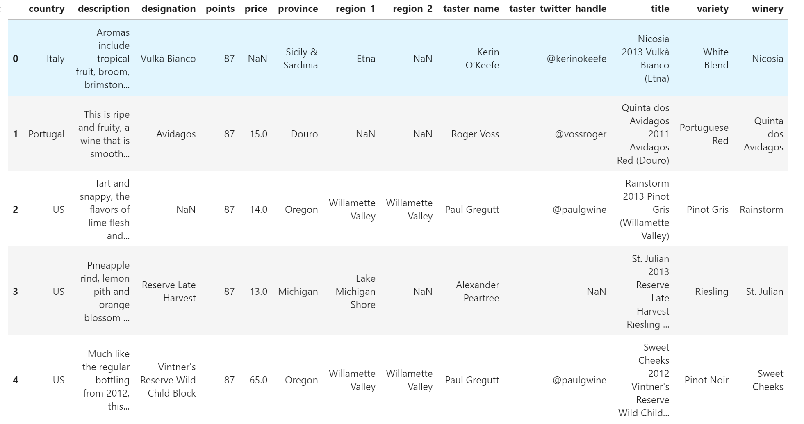

# Pandas学习-索引的loc和iloc

## 共性：

两者都是先行（rows）后列（columns）

## 区别

loc：works on labels in the index.

iloc：works on the positions in the index (so it only takes integers).

loc是根据表格的行和列的标签名字(labels)来索引的。

iloc是根据表格的行和列的标签位置数字（integers）来索引的。

比如：

**iloc索引：**


**loc索引：**


## 注意的地方

iloc是从0开始的。**iloc的0：X中不包括X，只能到X-1.**

loc 是从头开始的

## 举例：



将上面这个表格的‘country’和‘variety’两列的1-100行提取出来

```python
# 读取表格
reviews = pd.read_csv("../input/wine-reviews/winemag-data-130k-v2.csv", index_col=0)

# solution by loc
cols = ['country', 'variety']
df = reviews.loc[:99, cols]

# solution by iloc
cols_idx = [0, 11]
df = reviews.iloc[:100, cols_idx]
```

