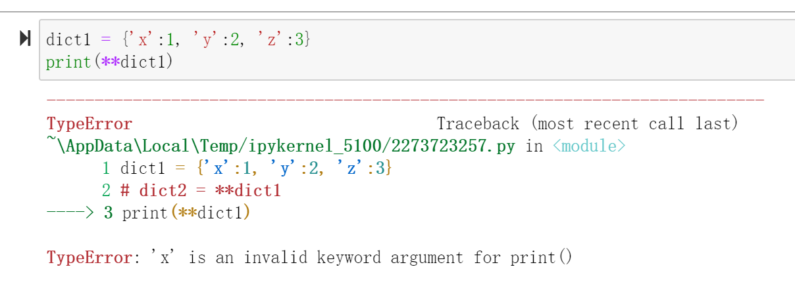

# 精华转载：*运算符在Python中的解压、传参用法

## 1.自己的阐述和理解

### 1.1 *运算符的作用

*运算符不只是表示乘号，还可以对list数据进行unpack（解压）。将一个完整的list数据，变成一个一个单独的元素。比如在解压zip函数（这个函数就是将一对list变为tuple这种数据格式）这个的应用上:

```python
stuff = ['apple','banana','peach']
money = [10, 5, 7]

pair = list(zip(stuff,money))
# pair = [('apple', 10), ('banana', 5), ('peach', 7)]
```

上述代码将pair变为list数据，如果我们想再次提取出stuff和money这样的数据，就可以用*运算符

```python
stuff,money = zip(*pair)
```

如果不是成对的list，那么就是把list里面的元素一个一个的变为单独的元素。就不是整个的list.

```python
list1 = ['a','b','c']
print(list1)
print(*list1)

# ['a', 'b', 'c']
# a b c
```

如果是字典dict数据，那么是得到字典的keys.

```python
dict1 = {'x':1, 'y':2, 'z':3}
print(*dict1)
# x y z
```


### 1.2 **运算符的作用

**运算符是传入参数的时候才会用到，如果直接对字典进行\*\*运算符的操作，那么是会出问题的。



**相当于\*\*运算符是把dict1, 变为了x=1,y=2,z=3的参数输入。**

一些具体的用法见下面的转载。

---


## 2.转载出处

[*运算符在Python中的解压、传参用法](https://zhuanlan.zhihu.com/p/54738146)

