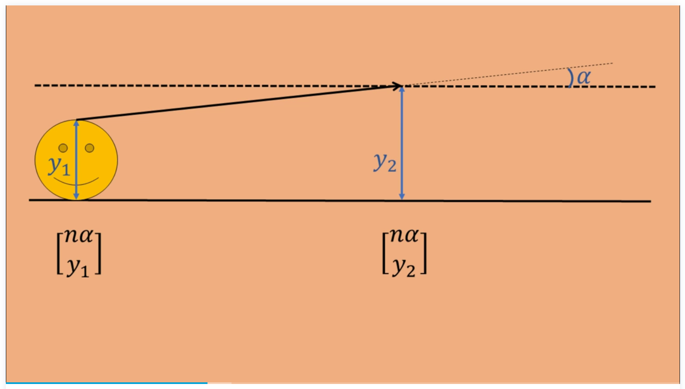

# Geometric Optics

ray optics 就是把光看成光线，虽然这个模型是不准确的，因为光还有波动性，都是这个模型在一定范围内是有效而简单的。

一些复杂的光学系统，用wave optics分析非常复杂，所以一般也用几何光学分析。

小孔成像：pinhole imaging

什么是成像：一个点A发出的光在另外一个点B接受。点B的光全部来自于点A

Imaging: all the light that ends up at one point, came from one point.

一般来讲，通过小孔的光线越小，越符合上述成像的定义。

但是，因为小孔越小，在成像面的光线就越少，所以也就越暗。所以我们需要可以聚焦光的透镜。

然后，我们得知道透镜的功能。（这一部分就是初中物理的知识了）

了解透镜的焦距，成实像和虚像，平行光入射和一定倾斜角度的平行光入射会出现什么。

凸透镜的规则，凹透镜的规则

接下来是用矩阵定义几何光学的作用：

如上图所示，可以通过矩阵符号来计算每个光学元件对成像目标$y_1$的作用，最后得到$y_2$的结果。

比如单透镜的效果，矩阵中不同的元素为0可以得到物像之间不同的指标。

未完待续。。。
